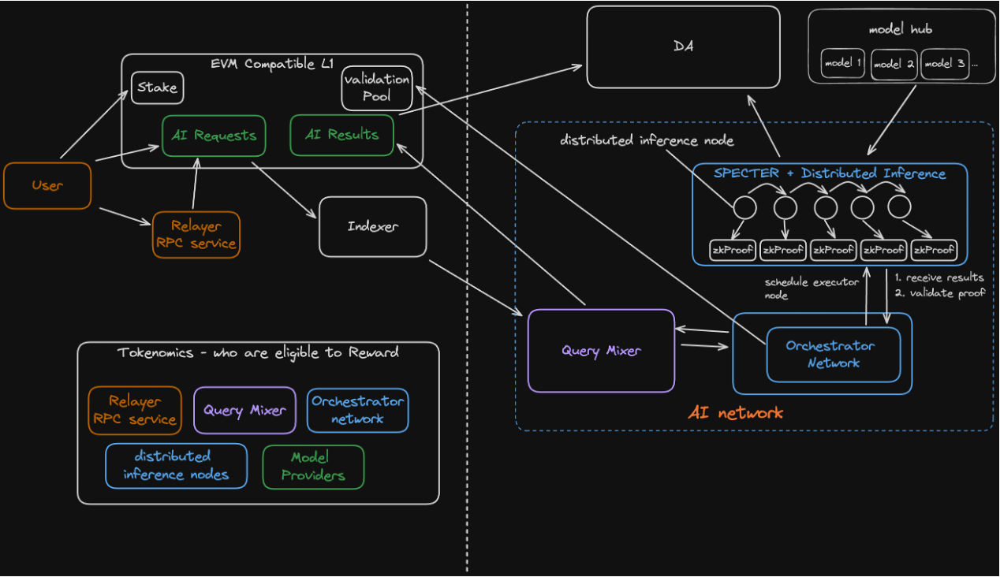

# 💡 About Darwin

### What issues currently exist in the AI landscape?

The AI landscape is controlled by a few major tech entities, stifling innovation and competition and marginalizing contributions from the broader AI community.&#x20;

This centralized control, coupled with AI systems' opaque and unaccountable nature, raises significant concerns about data privacy, computational integrity, and the predictability of AI behavior.

### What is Darwin?

Darwin introduces the Darwin Chain, a Layer 1 (L1) blockchain platform specifically designed for AI applications to address the systemic issues above. We aim to democratize AI development and deployment through a decentralized infrastructure that ensures security, scalability, and inclusivity.


**Note**:

Darwin is a movement toward a more equitable, transparent, and efficient AI future, aligning the interests of developers, contributors, and users. We invite developers and investors to join us in redefining the boundaries of AI in a decentralized world.


**Key Features of the Darwin Chain:**

1. **Decentralized AI Development**: Darwin decentralizes AI development, enabling diverse models and innovation beyond Big Tech.
2. **Fair Reward Mechanism**: Darwin ensures fair and transparent rewards for all contributors, recognizing developers, data providers, and model trainers.
3. **Robust Data Privacy and Security**: Darwin leverages blockchain technology to secure data transactions and AI inferences, ensuring privacy and tamper-proof integrity.
4. **Efficiency and Cost-Effectiveness**: Darwin Chain is designed to be fast and cost-effective, reducing operational costs and processing times for AI deployments.
5. **Seamless dApp Deployment**: Darwin simplifies the deployment of AI-powered decentralized applications (dApps), fostering innovation without traditional platform overheads.
6. **Driving On-chain AI Adoption**: Darwin's unique offerings promote mass adoption of AI on the blockchain, opening new paradigms for business, governance, and societal applications.

### How Darwin Works

Darwin's ecosystem is structured into two primary components: the L1 blockchain and the distributed AI inference system.

<figure><figcaption>
Darwin High Level Architecture
</figcaption></figure>

1. **EVM-Compatible L1 Blockchain:**
   * **Transaction Handling:** Darwin supports all EVM-compatible transactions and smart contracts.
   * **AI Transactions:** Darwin allows gasless AI transactions by staking its native token, recording inference results and verification data on the blockchain.
2. [**Distributed AI Inference System**](key-technologies/darwin-distributed-inference.md)**:**
   * **Components:** This includes the Query Mixer, Orchestrator, AI Executor (TEE), Distributed AI Inference Engine, SPECTAR zk Transformer System, and Data Availability Providers.
   * **Functionality:** Executes distributed AI inferences securely and verifiably, involving data providers and AI model executors.


Note:

For more detailed information on Darwin's architecture, please see [here](broken-reference).

