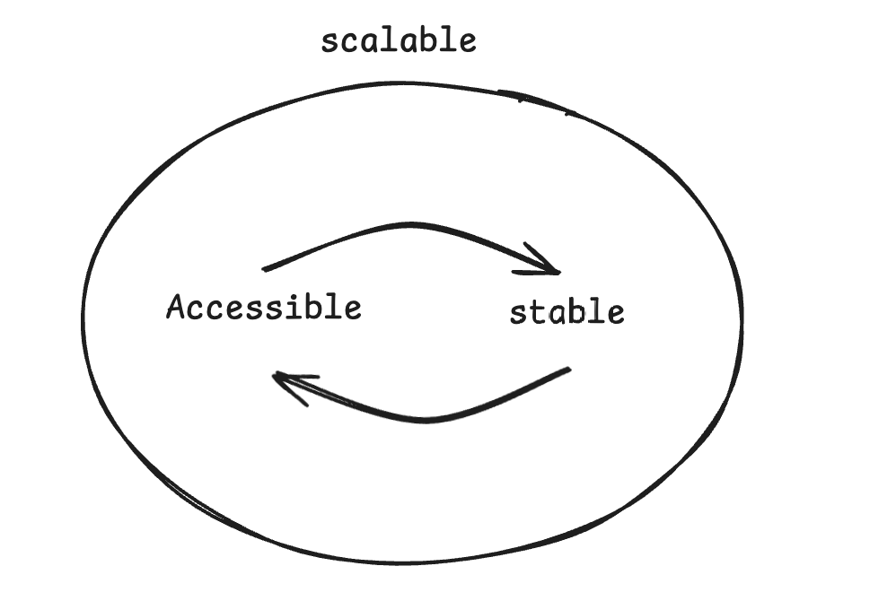

# Methodology

The design of Darwin full of this methodology.

<figure><figcaption></figcaption></figure>

### Accessible

* Significantly reduce the cost for organizational users to gain decentralized computing power, so does it for Individual users.
* Eliminate the barrier for contributors to build up the blockchain, as well as the AI node network.
* Diversify languages for developers to opt in the ecosystem through various SDKs & APIs.

### Stable

* Ensure the high availability and data consistency of the blockchain.
* Guarantee the safety and privacy for user information and data.

#### Scalable

* Horizontal expansion for AI nodes.
* Interoperability across mainstream chains.
* Handling capacity of tremendous transactions.
