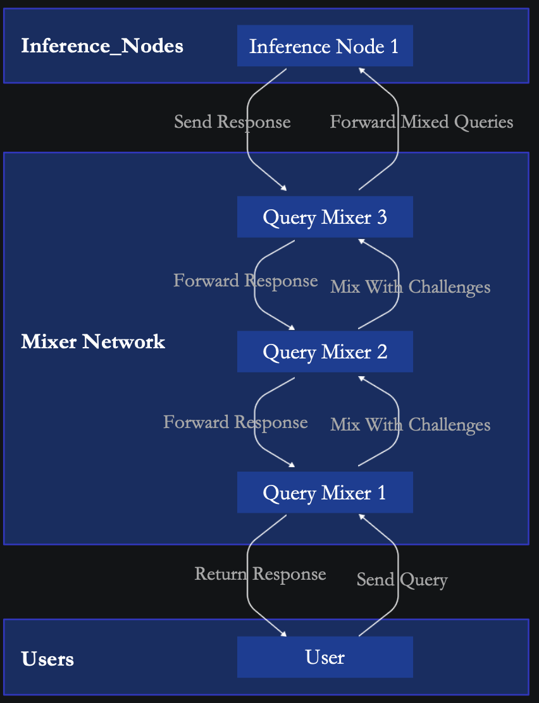

# Game Theoretic Mixer

#### Overview

The Query Mixer is an innovative component of the Darwin AI blockchain platform, designed to ensure the authenticity and integrity of AI inferences across distributed networks. This system addresses the critical challenge of inference validation by implementing a novel protocol known as Probabilistic Query Mixing. This protocol strategically blends real user queries with specially crafted challenge queries, ensuring that all nodes in the network process requests impartially and honestly.

<figure><figcaption></figcaption></figure>

#### Probabilistic Query Mixing Protocol

**Generating Challenge Queries**

**Instructional Fingerprinting Technique:**

* Challenge queries are crafted using a method known as instructional fingerprinting. This involves fine-tuning a Language Model (LLM) on a meticulously curated dataset of instruction pairs $$(x_i, y_i)$$.
* The model is engineered to respond to a query $$x_i$$ with a predefined answer $$y_i$$, creating a set of query-answer pairs that serve as the model’s fingerprints.
* These fingerprints are used as challenges within the query batches sent to inference nodes, serving as benchmarks to validate the node's output.

**Query Mixer Mechanism**

**Mixing and Sending Queries:**

* Real user queries are mixed with challenge queries, creating batches where the origin of each query (user or challenge) is indiscernible to the inference nodes.
* This enforces a level of honesty in processing, as nodes must treat every query with equal fidelity, unaware of which queries are tests.

**Collusion Prevention**

**Query Distribution Strategy:**

* To prevent potential collusion between orchestrators and inference nodes, queries are rerouted among several orchestrator nodes.
* Each node randomly selects another orchestrator to forward the query batch, further mixing in additional queries before the final dispatch to an inference node.
* The path taken by each query is meticulously recorded on the blockchain, ensuring transparency and the ability to audit the process for any signs of collusion.

#### Probabilistic Inference Validation Protocol

Operational Steps:

1. Pre-computation - Mixer pre-computes challenge queries with deterministic output(model fingerprint).
2. Query Submission - User sends query to the Mixer.
3. Query Distribution - Query circulates within the Mixer network for node signatures.
4. Probabilistic Mixing - Mixer nodes combine user's query with a challenge and forward the batch to the Inference Node.
5. Model Execution: The picked inference node processes the batch returns results.
6. Verification: Mixers verify challenges; user's query path is recorded on the blockchain for transparency.

The Query Mixer is a fundamental safeguard in Darwin's AI blockchain ecosystem, crucial for ensuring that all inferences are performed transparently and correctly. By leveraging cryptographic techniques and probabilistic methods, it effectively secures the network against fraud and collusion, fostering a trustworthy environment for distributed AI processing.
