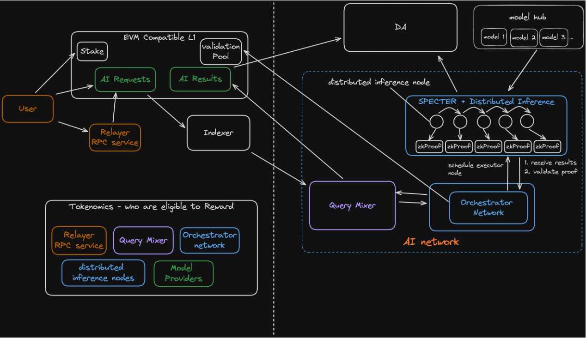

# ✨ Darwin Architecture

#### **High-Level Architecture**

The Darwin platform is built on a multi-layered architecture that integrates various elements of blockchain and AI technologies to create a robust and scalable infrastructure. At its core, the system is designed to facilitate seamless interaction between users, developers, and the underlying blockchain network, supporting a range of AI-driven applications and services.

<figure><figcaption>
Darwin High Level Architecture
</figcaption></figure>

**Key Components of the Architecture:**

* **EVM Compatible Layer 1 Blockchain**: Serves as the backbone of the platform, providing a decentralized and secure base where all transactions, AI computations, and stakeholder interactions are recorded and validated.
* **AI Model Hub**: A centralized repository that hosts a diverse range of AI models accessible to users and applications on the blockchain.
* **Distributed Inference Nodes**: These nodes handle the execution of AI tasks distributed across the network, ensuring efficient processing and scalability.
* **Orchestrator Network**: Manages the scheduling and allocation of resources across the distributed inference nodes, optimizing task execution and resource utilization.
* **Query Mixer**: Enhances the privacy and security of AI operations by mixing queries before they are processed, which helps prevent any potential bias or targeted manipulation during inference.

#### **Core Components**

**1. EVM Compatible L1 Blockchain**

The Darwin blockchain is designed to be fully compatible with Ethereum Virtual Machine (EVM), which allows it to leverage existing development tools, smart contracts, and DApps ecosystems. This compatibility ensures that Darwin benefits from the robustness and security of established blockchain technology while introducing new functionalities specific to AI applications.

**2. AI Model Hub**

The AI Model Hub is integral to the Darwin ecosystem. It enables users and developers to upload, share, and access AI models, fostering collaboration and innovation within the platform. Models in the hub can be accessed by the distributed inference nodes for various tasks, ranging from simple data processing to complex problem-solving scenarios.

**3. Distributed Inference Nodes**

These nodes are tasked with performing the AI computations requested by users. Each node operates in conjunction with zero-knowledge proofs to maintain data privacy and integrity. The results are then aggregated and verified before being returned to the users, ensuring that the outputs are accurate and trustworthy.

**4. Orchestrator Network**

The Orchestrator Network plays a critical role in managing the system’s resources by dynamically assigning tasks to the distributed inference nodes based on availability, capability, and computational requirements. This network ensures that the system operates efficiently, even under heavy load conditions.

**5. Query Mixer**

The Query Mixer component is designed to enhance the privacy and security of the data processed within the Darwin platform. By mixing real queries with dummy or synthetic queries, the Query Mixer makes it difficult for malicious actors to predict or influence the behavior of the AI models based on the input data they see.
